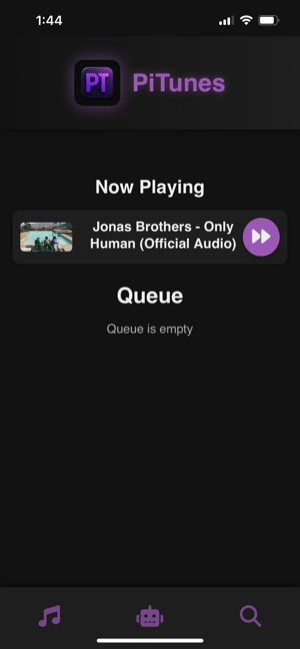
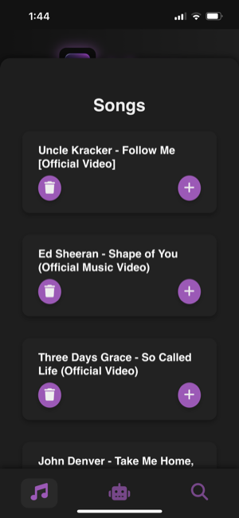

# PiTunes

This project is a full-stack, self-hosted, YouTube-powered jukebox system, designed to be deployed on a Raspberry Pi or any Linux host.

- Backend: .NET 8 (ASP.NET Core)
- Frontend: Angular
- Playback: `yt-dlp` + `ffplay` (YouTube audio extraction + playback)
- Deployment: Docker Compose
- Audio: Direct host audio passthrough (ALSA)

---

## ⚙️ Features

- Search YouTube for songs.
- Queue songs to play in real-time.
- Automatic downloading and caching of songs.
- Runs entirely self-hosted with no third-party streaming services required.

---

## 🖥 Architecture

- **Frontend** (`/frontend`): Angular app running in NGINX container (port `4200`).
- **Backend** (`/backend`): ASP.NET Core Web API container (port `5219`) handling search, queue management, playback, and caching.
- **Docker Compose** coordinates both containers.
- **Audio playback** happens directly on the host machine via ALSA.

---

## 🚀 Raspberry Pi Deployment

1. **Clone this repo to your Raspberry Pi**

```bash
git clone git@github.com:AyresJeremiah/PiTunes.git
cd PiTunes
```

2. **Run the setup script**

```bash
sudo bash install.sh
```

> This will:
> - Install all required dependencies
> - Install `yt-dlp`, `ffmpeg`, `alsa-utils`, `docker`, `docker-compose`
> - Build the Docker containers
> - Launch the system via `docker-compose`

---

## 🔊 Audio Device Pass-through

- The backend container requires access to your host audio device.
- The docker-compose file mounts `/dev/snd` into the container.
- Be sure your Raspberry Pi is properly configured for audio output.
- Test sound output with:

## 🧠 AI Integration (Optional)

PiTunes supports optional AI-based song suggestion functionality using a local [Ollama](https://ollama.com/) instance. To enable this feature:

### 1. **Enable AI in `appsettings.json`**

Inside the `backend/appsettings.json` file, locate or add the following section:

```json
"Features": {
  "AIEnabled": true
}
```

> Set `AIEnabled` to `false` to hide the AI UI and disable suggestion features.

---

### 2. **Configure Ollama (Optional)**

To customize the model or endpoint used for AI generation, update the `Ollama` section:

```json
"Ollama": {
  "Endpoint": "http://localhost:11434/api/generate",
  "Model": "gemma3:4b"
}
```

- `Endpoint`: URL of your Ollama server (default: `localhost:11434`)
- `Model`: Name of the model to use for generation (e.g., `llama3:8b`, `gemma3:4b`, etc.)

> Ollama must be running on the host for AI features to work. See [https://ollama.com](https://ollama.com) for installation instructions.

---

### 3. **Frontend Behavior**

When `AIEnabled` is set to `false`, the Angular UI will automatically hide all AI-related components at startup. No extra steps are needed.


```bash
speaker-test -c2 -t sine
```

---

## 🔧 Manual Docker (if you're not using bootstrap.sh)

```bash
# Build and run Docker containers
docker-compose build
docker-compose up -d
```

---

## 📂 Folder Structure

```bash
backend/             # .NET backend code
frontend/            # Angular frontend code
docker-compose.yml   # Docker orchestration
bootstrap.sh         # Raspberry Pi installation script
```

---

## ⚠ Legal Disclaimer

This tool uses `yt-dlp` to extract and play audio from YouTube. Please review YouTube's Terms of Service before public use. This project is intended for personal, educational, and self-hosted deployments only.

---

## ❤️ Credits

- [yt-dlp](https://github.com/yt-dlp/yt-dlp)
- [FFmpeg](https://ffmpeg.org/)
- [ASP.NET Core](https://dotnet.microsoft.com/)
- [Angular](https://angular.io/)

---- ## 📸 Screenshots







